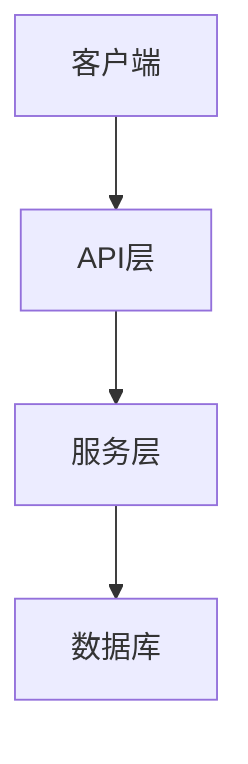
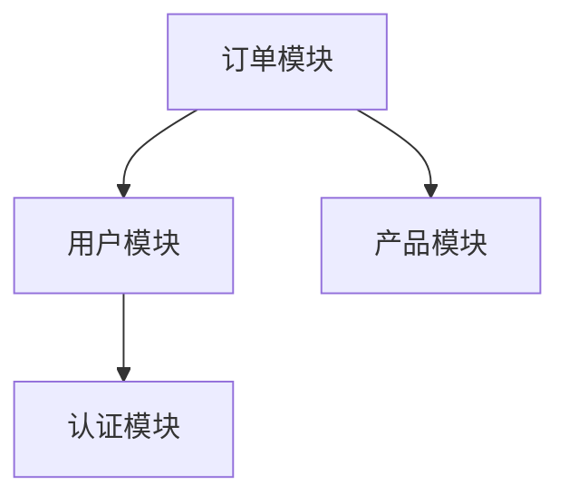

# Codebase Mapper 技能定义

## 技能名称
codebase-mapper

## 技能描述
专门读取 `projects/[项目名称]/legacy-assets/` 目录下的代码和文档，分析系统架构和模块依赖关系，输出系统架构图和模块依赖图。

## 工作边界
- 仅处理 `projects/[项目名称]/legacy-assets/` 目录下的文件
- 不修改任何源代码
- 仅输出 Mermaid 格式的架构图
- 专注于分析模块间的依赖关系
- 支持多种编程语言和框架

## 输入要求
- 项目名称：需要知道当前处理的项目名称，以便定位到正确的 `legacy-assets/` 目录
- 可选参数：代码语言、框架类型、分析深度

## 输出
- 在 `projects/[项目名称]/docs/` 生成 `01-系统现存架构图.md` 文件
- 包含系统整体架构图（Mermaid 格式）
- 包含模块依赖关系图（Mermaid 格式）
- 包含核心模块的职责说明
- 包含文件结构分析

## 执行逻辑
1. 扫描 `projects/[项目名称]/legacy-assets/` 目录下的所有文件
2. 识别代码文件、配置文件、文档文件
3. 分析模块间的依赖关系
4. 生成 Mermaid 格式的架构图
5. 生成 Mermaid 格式的依赖关系图
6. 整理分析结果到 `01-系统现存架构图.md` 文件

## 示例输出格式
```markdown
# 系统现存架构图

## 整体架构



## 模块依赖关系



## 核心模块职责

### 认证模块
- 负责用户登录、注册
- 处理 token 生成和验证
- 提供权限控制

### 用户模块
- 管理用户信息
- 处理用户资料更新
- 提供用户查询接口

## 文件结构分析

```
legacy-assets/
├── src/
│   ├── auth/
│   ├── user/
│   ├── order/
│   └── product/
├── config/
└── docs/
```
```
