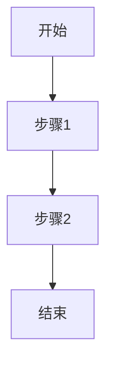
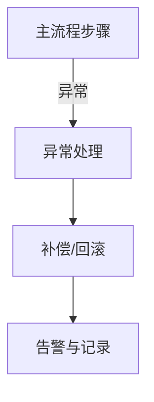
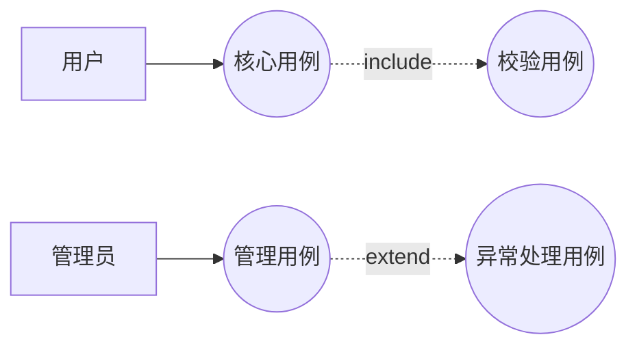

# 《<系统/模块名>》详细设计说明书

## 1. 背景与范围

- 背景：
- 目标：
- 范围内：
- 范围外：

## 2. 术语与角色

| 术语/角色 | 说明 |
|---|---|
|  |  |

## 3. 总体设计与模块划分

- 模块 A：
- 模块 B：
- 依赖系统：

## 4. 接口设计

### 4.1 接口清单

| 编号 | 接口名 | 协议 | 路径/主题 | 调用方 -> 被调方 | 对应需求 |
|---|---|---|---|---|---|
| API-01 |  | HTTP/RPC/MQ |  |  | RQ-01 |

### 4.2 接口详细定义

#### API-01 <接口名>

- 目标：
- 鉴权：
- 幂等策略：
- 限流策略：

**请求参数**

| 字段 | 类型 | 必填 | 约束 | 示例 |
|---|---|---|---|---|
|  |  | Y/N |  |  |

**响应参数**

| 字段 | 类型 | 说明 |
|---|---|---|
| code | string | 业务状态码 |
| message | string | 结果描述 |
| data | object | 业务数据 |

**错误码**

| 错误码 | 场景 | 处理建议 |
|---|---|---|
|  |  |  |

## 5. 数据库表设计

### 5.1 表清单

| 表名 | 用途 | 主键 | 关联关系 |
|---|---|---|---|
|  |  |  |  |

### 5.2 表结构明细

#### 表：`<table_name>`

| 字段名 | 类型 | 非空 | 默认值 | 说明 |
|---|---|---|---|---|
| id | bigint | Y | - | 主键 |

- 索引设计：
- 状态流转：
- 一致性策略：
- 归档策略：

## 6. 流程设计

### 6.1 主流程

### 6.2 异常与补偿流程

## 7. 用例设计

### 7.1 用例关系图

### 7.2 用例明细

#### UC1 核心用例

- 前置条件：
- 后置条件：
- 主场景：
1. 
2. 
3. 
- 异常场景：
1. 
2. 

## 8. 非功能设计

- 性能：
- 安全：
- 可观测性：
- 可维护性：

## 9. 风险与待确认项

| 编号 | 问题 | 影响 | 建议 |
|---|---|---|---|
| Q-01 |  |  |  |

## 10. 需求-设计追踪矩阵

| 需求编号 | 需求描述 | 接口 | 表 | 流程步骤 | 用例 |
|---|---|---|---|---|---|
| RQ-01 |  | API-01 | table_xxx | Step-1 | UC1 |
