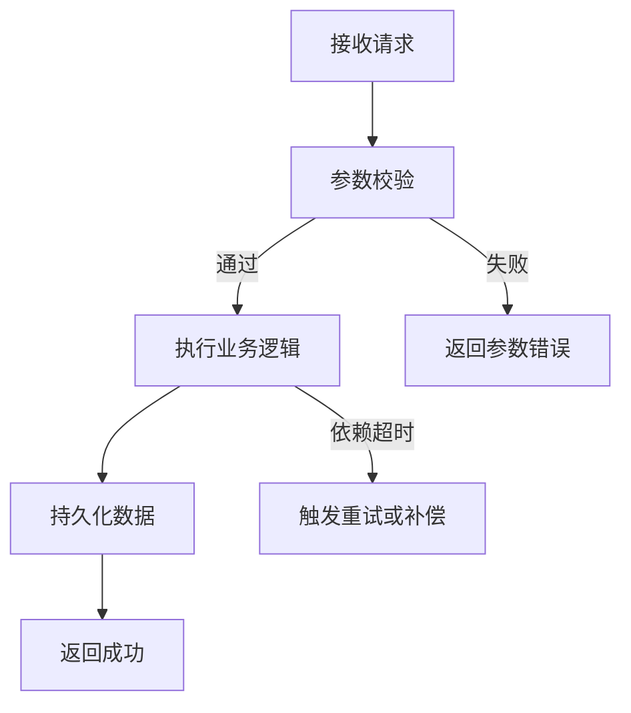
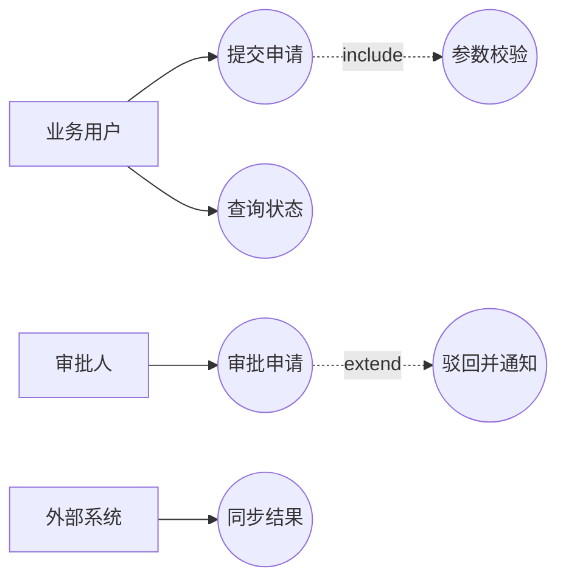

# Mermaid

## 流程图模板

```mermaid
flowchart TD
    A[接收请求] --> B[参数校验]
    B -->|通过| C[执行业务逻辑]
    B -->|失败| X[返回参数错误]
    C --> D[持久化数据]
    D --> E[返回成功]
    C -->|依赖超时| Y[触发重试或补偿]
```

## 用例图近似模板（Mermaid）

```mermaid
flowchart LR
    U[业务用户] --> UC1((提交申请))
    U --> UC2((查询状态))
    A[审批人] --> UC3((审批申请))
    S[外部系统] --> UC4((同步结果))

    UC1 -. include .-> UC5((参数校验))
    UC3 -. extend .-> UC6((驳回并通知))
```

说明：

- Mermaid 不原生支持 UML Use Case，使用 `flowchart` 表达 Actor 与用例关系。
- `-. include .->` 与 `-. extend .->` 用于标注近似关系。
