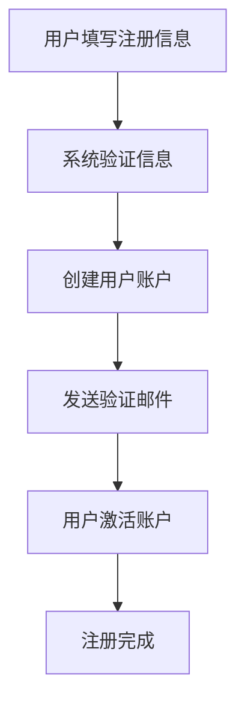
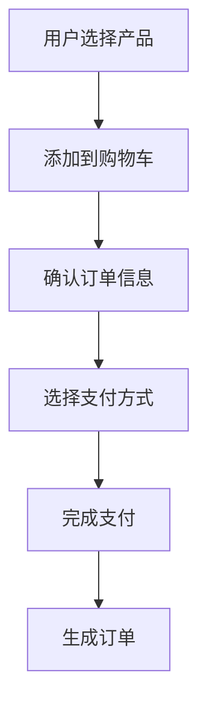

# Reverse PRD Generator 技能定义

## 技能名称
reverse-prd-generator

## 技能描述
结合 codebase-mapper 和 schema-reverse-engineer 的分析结果，反向推导出老系统的存量 PRD 和业务逻辑基线，并标记出高风险或写死（Hardcode）的技术债代码。

## 工作边界
- 基于前两个步骤的分析结果进行工作
- 不修改任何源代码
- 专注于业务逻辑的提炼和技术债的识别
- 输出结构化的 PRD 文档
- 标记高风险代码区域

## 输入要求
- 项目名称：需要知道当前处理的项目名称
- 依赖文件：
  - `projects/[项目名称]/docs/01-系统现存架构图.md`
  - `projects/[项目名称]/docs/02-现存数据字典.md`
- 可选参数：分析深度、重点关注模块

## 输出
- 在 `projects/[项目名称]/docs/` 生成 `03-存量业务逻辑基线.md` 文件
- 包含系统功能模块列表
- 包含详细的业务流程描述
- 包含技术债分析
- 包含高风险代码区域标记
- 包含业务规则总结

## 执行逻辑
1. 读取前两个步骤生成的分析文档
2. 结合 `projects/[项目名称]/legacy-assets/` 中的代码和文档进行深入分析
3. 识别系统的功能模块和业务流程
4. 分析业务规则和逻辑
5. 识别技术债和高风险代码
6. 整理分析结果到 `03-存量业务逻辑基线.md` 文件

## 示例输出格式
```markdown
# 存量业务逻辑基线

## 系统功能模块

### 1. 用户管理模块
- 用户注册
- 用户登录
- 用户资料管理
- 密码重置

### 2. 订单管理模块
- 订单创建
- 订单查询
- 订单状态管理
- 订单支付

### 3. 产品管理模块
- 产品列表
- 产品详情
- 产品分类

## 业务流程

### 用户注册流程



### 订单创建流程



## 技术债分析

### 高风险代码区域
1. **用户密码存储**：密码直接存储在数据库中，未进行加密处理
2. **硬编码配置**：数据库连接信息硬编码在代码中
3. **缺乏错误处理**：关键操作缺少错误处理机制
4. **性能问题**：大量数据查询未使用索引

### 技术债详细分析
| 问题类型 | 位置 | 影响 | 建议 |
|---------|------|------|------|
| 密码安全 | `auth/service.js` | 安全风险 | 使用 bcrypt 加密存储 |
| 硬编码 | `config/database.js` | 维护困难 | 使用环境变量 |
| 错误处理 | `order/controller.js` | 系统稳定性 | 添加 try-catch 处理 |
| 性能 | `product/service.js` | 响应缓慢 | 添加数据库索引 |

## 业务规则总结

### 用户规则
- 用户名必须唯一
- 密码长度至少 6 位
- 邮箱格式必须正确

### 订单规则
- 订单状态流转：待支付 → 已支付 → 待发货 → 已发货 → 已完成
- 订单金额必须大于 0
- 订单商品数量必须大于 0

### 产品规则
- 产品价格必须大于 0
- 产品库存必须大于等于 0
- 产品分类必须存在
```
