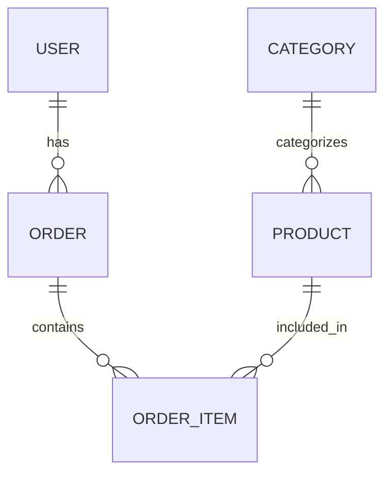

# Schema Reverse Engineer 技能定义

## 技能名称
schema-reverse-engineer

## 技能描述
专门解析 `projects/[项目名称]/legacy-assets/` 中的代码类型定义、建表 SQL 或老 API 文档，逆向提炼出核心数据字典和实体关系图。

## 工作边界
- 仅处理 `projects/[项目名称]/legacy-assets/` 目录下的文件
- 不修改任何源代码
- 专注于数据模型和实体关系的分析
- 支持多种数据定义格式（SQL、TypeScript Interface、实体类等）
- 输出标准化的数据字典格式

## 输入要求
- 项目名称：需要知道当前处理的项目名称，以便定位到正确的 `legacy-assets/` 目录
- 可选参数：数据定义类型、数据库类型、分析深度

## 输出
- 在 `projects/[项目名称]/docs/` 生成 `02-现存数据字典.md` 文件
- 包含核心实体的详细数据字典
- 包含实体关系图（Mermaid 格式）
- 包含字段类型、约束、默认值等信息
- 包含表与表之间的关联关系

## 执行逻辑
1. 扫描 `projects/[项目名称]/legacy-assets/` 目录下的所有文件
2. 识别 SQL 文件、类型定义文件、实体类文件
3. 解析数据模型定义
4. 提取字段信息、约束条件
5. 分析实体间的关联关系
6. 生成 Mermaid 格式的实体关系图
7. 整理分析结果到 `02-现存数据字典.md` 文件

## 示例输出格式
```markdown
# 现存数据字典

## 实体关系图



## 核心实体数据字典

### USER 表
| 字段名 | 数据类型 | 约束 | 描述 |
|-------|---------|------|------|
| id | INT | PRIMARY KEY | 用户ID |
| username | VARCHAR(50) | UNIQUE NOT NULL | 用户名 |
| email | VARCHAR(100) | UNIQUE NOT NULL | 邮箱 |
| password | VARCHAR(255) | NOT NULL | 密码 |
| created_at | TIMESTAMP | DEFAULT CURRENT_TIMESTAMP | 创建时间 |
| updated_at | TIMESTAMP | DEFAULT CURRENT_TIMESTAMP ON UPDATE CURRENT_TIMESTAMP | 更新时间 |

### ORDER 表
| 字段名 | 数据类型 | 约束 | 描述 |
|-------|---------|------|------|
| id | INT | PRIMARY KEY | 订单ID |
| user_id | INT | FOREIGN KEY REFERENCES USER(id) | 用户ID |
| total_amount | DECIMAL(10,2) | NOT NULL | 总金额 |
| status | VARCHAR(20) | NOT NULL | 订单状态 |
| created_at | TIMESTAMP | DEFAULT CURRENT_TIMESTAMP | 创建时间 |

### ORDER_ITEM 表
| 字段名 | 数据类型 | 约束 | 描述 |
|-------|---------|------|------|
| id | INT | PRIMARY KEY | 订单项ID |
| order_id | INT | FOREIGN KEY REFERENCES ORDER(id) | 订单ID |
| product_id | INT | FOREIGN KEY REFERENCES PRODUCT(id) | 产品ID |
| quantity | INT | NOT NULL | 数量 |
| unit_price | DECIMAL(10,2) | NOT NULL | 单价 |

### PRODUCT 表
| 字段名 | 数据类型 | 约束 | 描述 |
|-------|---------|------|------|
| id | INT | PRIMARY KEY | 产品ID |
| name | VARCHAR(100) | NOT NULL | 产品名称 |
| description | TEXT | | 产品描述 |
| price | DECIMAL(10,2) | NOT NULL | 价格 |
| category_id | INT | FOREIGN KEY REFERENCES CATEGORY(id) | 分类ID |

### CATEGORY 表
| 字段名 | 数据类型 | 约束 | 描述 |
|-------|---------|------|------|
| id | INT | PRIMARY KEY | 分类ID |
| name | VARCHAR(50) | NOT NULL | 分类名称 |
| description | TEXT | | 分类描述 |
```
