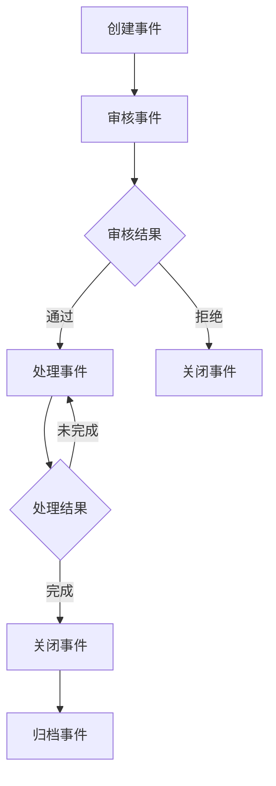
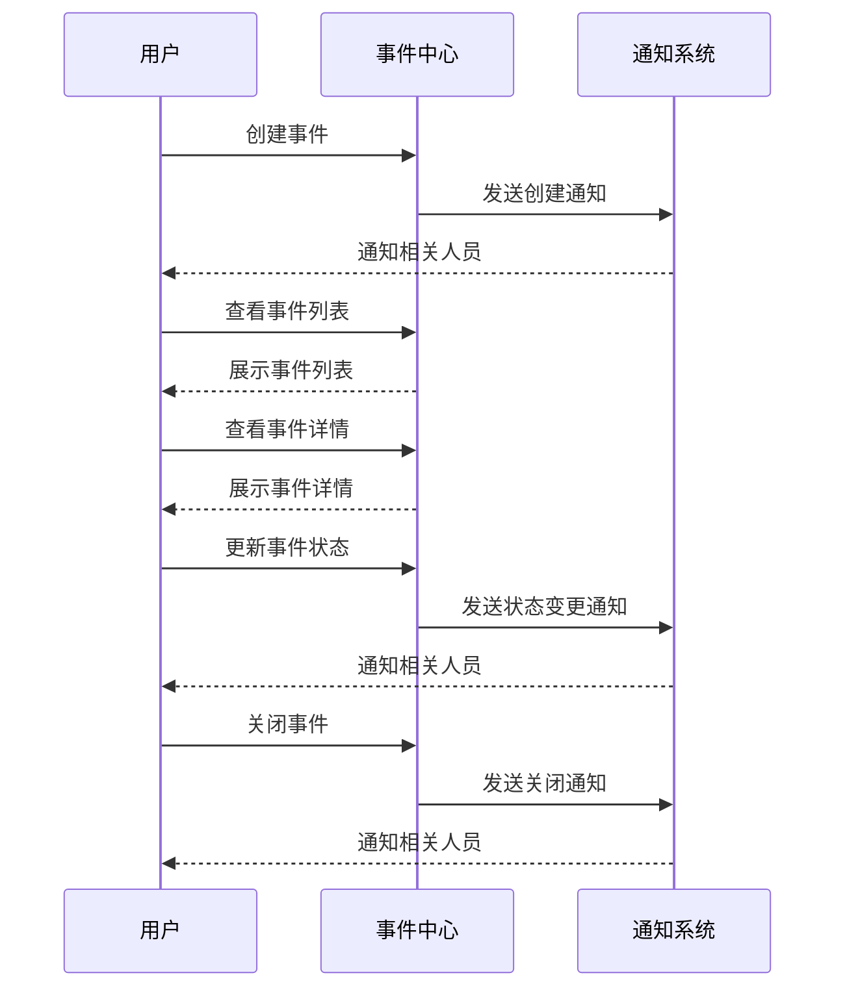

# 事件中心 PRD 文档

## 1. 产品概览

事件中心是一个集中管理和处理各类事件的平台，旨在为用户提供统一的事件管理、通知、分析和统计功能。
- 该平台将帮助组织和团队更有效地管理和响应各类事件，提高工作效率和决策质量。
- 产品价值在于提供一站式的事件管理解决方案，减少信息孤岛，提升组织的协作能力。

## 2. 核心功能

### 2.1 功能模块

我们的事件中心包含以下主要页面：
1. **事件列表页**：展示所有事件的概览，支持筛选、排序和搜索。
2. **事件详情页**：展示单个事件的详细信息，包括事件内容、状态、历史记录等。
3. **事件创建页**：用于创建新事件的表单页面。
4. **事件分析页**：展示事件数据的统计和分析结果。
5. **通知设置页**：用于配置事件通知规则和方式。

### 2.2 页面详情

| 页面名称 | 模块名称 | 功能描述 |
|-----------|-------------|---------------------|
| 事件列表页 | 事件筛选 | 支持按事件类型、状态、时间范围等条件筛选事件 |
| 事件列表页 | 事件排序 | 支持按创建时间、优先级、状态等字段排序 |
| 事件列表页 | 事件搜索 | 支持按事件标题、描述、创建者等关键词搜索 |
| 事件列表页 | 事件操作 | 支持查看详情、编辑、删除、标记状态等操作 |
| 事件详情页 | 基本信息 | 展示事件的标题、描述、类型、优先级、状态等基本信息 |
| 事件详情页 | 历史记录 | 展示事件的创建、更新、状态变更等历史记录 |
| 事件详情页 | 关联资源 | 展示与事件相关的文档、链接等资源 |
| 事件详情页 | 评论系统 | 支持对事件进行评论和讨论 |
| 事件创建页 | 事件表单 | 提供创建事件所需的各项字段，包括标题、描述、类型、优先级等 |
| 事件创建页 | 附件上传 | 支持上传与事件相关的附件 |
| 事件分析页 | 数据统计 | 展示事件数量、类型分布、状态分布等统计数据 |
| 事件分析页 | 趋势图表 | 展示事件数量随时间的变化趋势 |
| 事件分析页 | 导出功能 | 支持导出统计数据为 Excel、PDF 等格式 |
| 通知设置页 | 通知规则 | 配置事件通知的触发条件和规则 |
| 通知设置页 | 通知方式 | 配置通知的方式，如邮件、短信、站内信等 |
| 通知设置页 | 接收人管理 | 管理通知的接收人员和分组 |

## 3. 核心流程

### 事件生命周期流程

### 用户操作流程

## 4. 用户角色

| 角色 | 注册方式 | 角色权限 |
|---------|---------------------|------------------|
| 普通用户 | 系统注册 | 可创建事件、查看自己创建的事件、接收相关通知 |
| 事件处理员 | 管理员分配 | 可处理事件、更新事件状态、添加评论 |
| 管理员 | 系统预设 | 拥有所有权限，包括用户管理、系统配置、数据分析等 |
| 观察者 | 管理员分配 | 仅可查看事件，不可修改或处理 |

## 5. 数据结构

### 事件表

| 字段名 | 数据类型 | 描述 | 约束 |
|-----------|---------------------|---------------------|----------------|
| id | UUID | 事件唯一标识符 | 主键 |
| title | String | 事件标题 | 非空 |
| description | Text | 事件描述 | 非空 |
| type | String | 事件类型 | 非空 |
| priority | Integer | 优先级（1-5） | 非空 |
| status | String | 事件状态 | 非空 |
| creator_id | UUID | 创建者ID | 外键 |
| assignee_id | UUID | 负责人ID | 外键 |
| created_at | Timestamp | 创建时间 | 非空 |
| updated_at | Timestamp | 更新时间 | 非空 |
| closed_at | Timestamp | 关闭时间 | 可为空 |

### 事件历史表

| 字段名 | 数据类型 | 描述 | 约束 |
|-----------|---------------------|---------------------|----------------|
| id | UUID | 历史记录ID | 主键 |
| event_id | UUID | 事件ID | 外键 |
| action | String | 操作类型 | 非空 |
| user_id | UUID | 操作用户ID | 外键 |
| timestamp | Timestamp | 操作时间 | 非空 |
| details | Text | 操作详情 | 可为空 |

### 通知规则表

| 字段名 | 数据类型 | 描述 | 约束 |
|-----------|---------------------|---------------------|----------------|
| id | UUID | 规则ID | 主键 |
| name | String | 规则名称 | 非空 |
| event_type | String | 事件类型 | 可为空 |
| event_status | String | 事件状态 | 可为空 |
| priority | Integer | 优先级 | 可为空 |
| notification_method | String | 通知方式 | 非空 |
| recipients | JSON | 接收人列表 | 非空 |
| created_at | Timestamp | 创建时间 | 非空 |
| updated_at | Timestamp | 更新时间 | 非空 |

## 6. 界面设计

### 6.1 设计风格

- **主色调**：蓝色系（#1E88E5），代表专业、可信赖
- **辅助色**：绿色（#4CAF50）用于成功状态，红色（#F44336）用于错误状态，黄色（#FFC107）用于警告状态
- **按钮风格**：圆角按钮，有明显的悬停效果
- **字体**：系统默认无衬线字体，标题 16-20px，正文 14px，辅助文字 12px
- **布局风格**：响应式布局，左侧固定导航栏，右侧内容区域
- **图标风格**：使用 Material Design 图标，简洁明了

### 6.2 页面设计概览

| 页面名称 | 模块名称 | UI元素 |
|-----------|-------------|-------------|
| 事件列表页 | 顶部筛选栏 | 下拉选择框、日期选择器、搜索输入框、筛选按钮 |
| 事件列表页 | 事件表格 | 包含复选框、事件标题、类型、优先级、状态、创建时间、操作按钮等列 |
| 事件列表页 | 分页控件 | 页码显示、上一页/下一页按钮、每页显示条数选择 |
| 事件详情页 | 基本信息卡片 | 标题、描述、类型、优先级、状态等信息，支持编辑按钮 |
| 事件详情页 | 历史记录时间线 | 按时间顺序展示事件的历史操作记录 |
| 事件详情页 | 评论区 | 评论输入框、评论列表、回复功能 |
| 事件创建页 | 表单区域 | 标题输入框、描述文本域、类型选择、优先级选择、负责人选择等表单元素 |
| 事件创建页 | 附件上传 | 拖拽上传区域、文件列表展示 |
| 事件分析页 | 统计卡片 | 显示事件总数、待处理数、已完成数等关键指标 |
| 事件分析页 | 图表区域 | 柱状图、饼图、折线图等数据可视化图表 |
| 通知设置页 | 规则列表 | 规则名称、触发条件、通知方式、操作按钮等 |
| 通知设置页 | 规则编辑表单 | 规则名称输入、条件配置、通知方式选择、接收人选择等 |

### 6.3 响应式设计

- **桌面端**（>1200px）：完整展示所有功能和布局
- **平板端**（768px-1200px）：导航栏可折叠，表格适应宽度
- **移动端**（<768px）：导航栏转为底部或顶部菜单，表格转为卡片式布局

## 7. 非功能需求

- **性能要求**：页面加载时间不超过 2 秒，事件处理响应时间不超过 1 秒
- **安全要求**：所有用户操作需要权限验证，敏感数据加密存储
- **可靠性要求**：系统可用性达到 99.9%，数据定期备份
- **可扩展性**：支持水平扩展，以应对日益增长的事件量
- **兼容性**：支持主流浏览器，包括 Chrome、Firefox、Safari、Edge

## 8. 实施计划

### 8.1 开发阶段

1. **需求分析与设计**：2 天
2. **前端开发**：5 天
3. **后端开发**：5 天
4. **测试**：3 天
5. **部署**：1 天

### 8.2 里程碑

- **M1**：完成需求分析与设计，输出详细设计文档
- **M2**：完成前端基础框架搭建和核心页面开发
- **M3**：完成后端 API 开发和数据库设计
- **M4**：完成前后端集成和功能测试
- **M5**：完成系统部署和上线

## 9. 风险评估

| 风险 | 影响 | 可能性 | 缓解措施 |
|---------|-------------|-------------|-------------|
| 需求变更 | 开发时间延长 | 中 | 建立需求变更管理流程，定期与 stakeholders 沟通 |
| 性能问题 | 用户体验下降 | 低 | 进行性能测试，优化数据库查询和前端渲染 |
| 安全漏洞 | 数据泄露 | 低 | 进行安全测试，实施安全最佳实践 |
| 技术债务 | 维护成本增加 | 中 | 定期代码审查，遵循编码规范 |