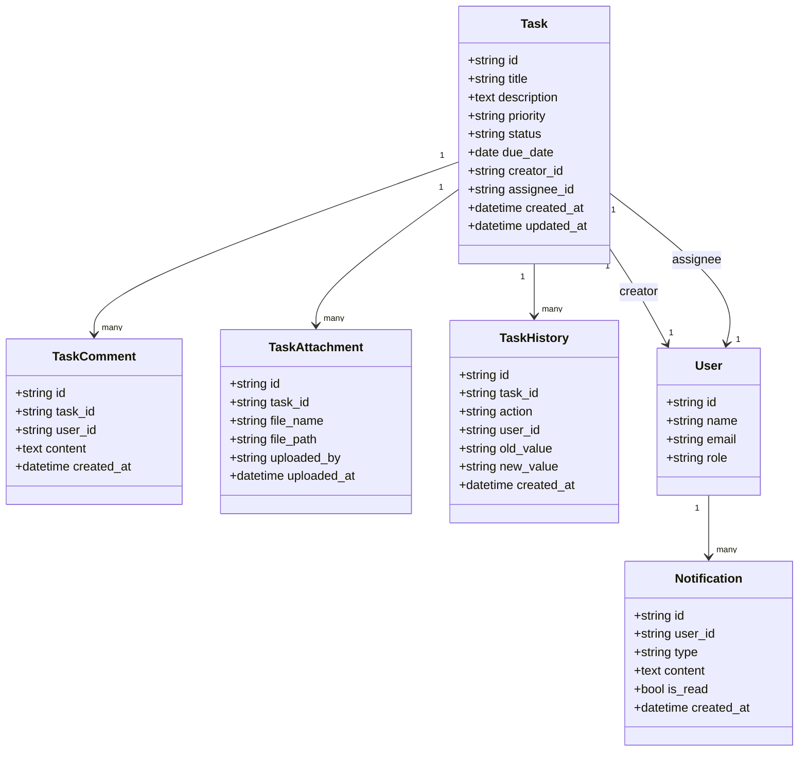
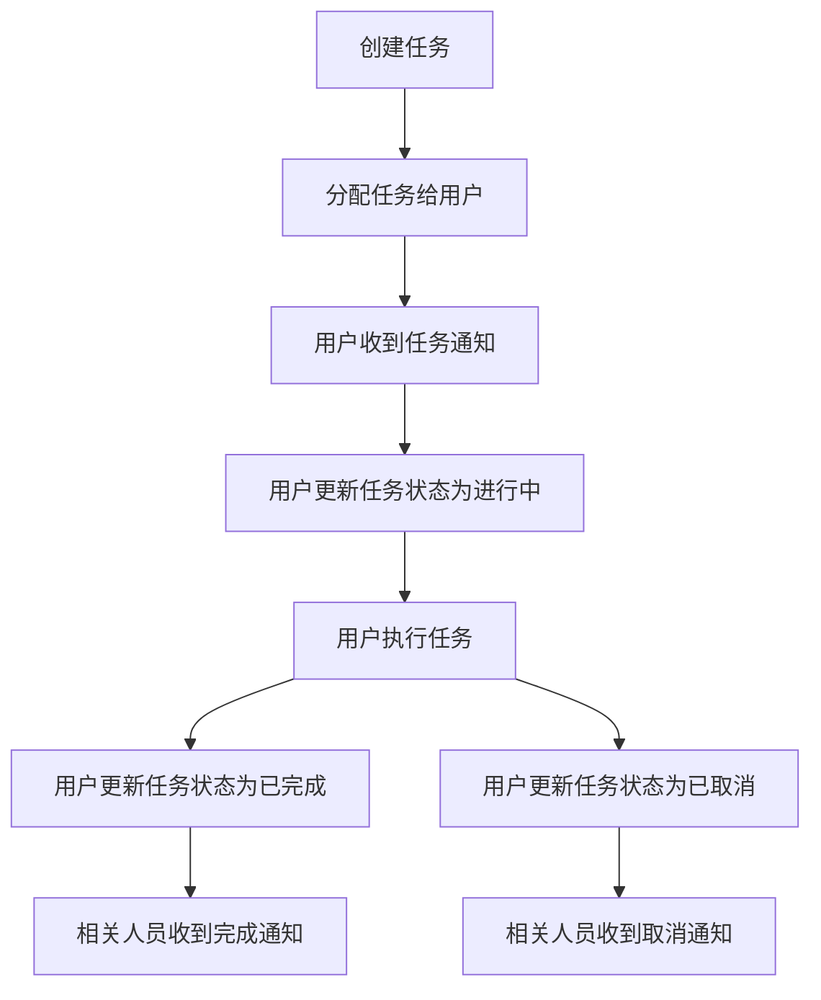
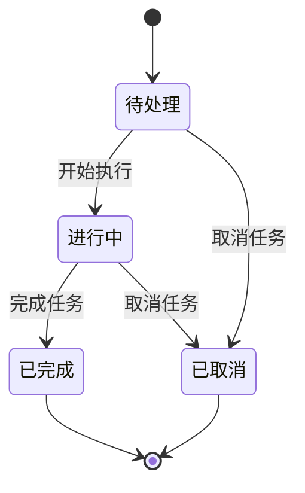

# RPD 示例（用户故事主导）：任务中心功能

> 说明：这里使用 `RPD` 命名（Requirements/Product Document）。如果团队习惯 `PRD`，可直接替换标题，不影响结构。

## 0. 文档信息

- 版本：`v1.0`
- 状态：`Draft`
- 目标上线：`2026-04-30`
- 负责人：`产品经理 / 任务管理小组`
- 关联范围：`任务列表`、`任务详情`、`任务创建`、`任务状态管理`、`任务通知`

---

## 1. 背景与目标

### 1.1 背景问题

当前任务管理存在以下问题：

1. 任务分散在不同系统中，用户需要登录多个平台查看和管理任务。
2. 任务状态不透明，无法实时了解任务进度和执行情况。
3. 任务分配和跟踪效率低下，缺乏统一的管理界面。
4. 任务通知不及时，导致重要任务延误。

### 1.2 业务目标

1. 提供统一的任务管理平台，集中展示所有系统的任务。
2. 实现任务全生命周期管理，从创建到完成的完整流程。
3. 提高任务分配和跟踪效率，减少沟通成本。
4. 确保任务通知及时送达，避免任务延误。
5. 提供任务数据分析，帮助管理者了解团队工作效率。

### 1.3 非目标

1. 本期不做任务自动分配算法（仅支持手动分配）。
2. 本期不做任务优先级智能调整（仅支持手动设置）。
3. 本期不做跨组织任务协同（仅支持内部任务管理）。

---

## 2. 用户角色

| 角色 | 核心诉求 | 使用频率 |
| --- | --- | --- |
| 普通用户 | 查看分配给自己的任务，更新任务状态，接收任务通知 | 高 |
| 团队负责人 | 分配任务，跟踪团队任务进度，查看团队任务统计 | 中 |
| 系统管理员 | 配置任务类型，管理用户权限，查看系统级任务统计 | 低 |

---

## 3. 用户故事（核心）

### US-01 查看任务列表

**As a** 普通用户  
**I want to** 在任务中心查看分配给自己的任务列表  
**So that** 我能快速了解需要完成的任务和优先级

**验收标准**

1. Given 用户登录系统  
   When 访问任务中心  
   Then 页面显示分配给该用户的所有任务，按优先级和截止日期排序。

2. Given 用户有多个任务  
   When 滚动任务列表  
   Then 系统支持分页加载，每页显示20条任务。

3. Given 用户需要筛选任务  
   When 点击筛选按钮  
   Then 可以按任务状态、优先级、截止日期等条件筛选任务。

---

### US-02 查看任务详情

**As a** 普通用户  
**I want to** 点击任务查看详细信息  
**So that** 我能了解任务的具体要求和相关信息

**验收标准**

1. Given 用户在任务列表中点击某任务  
   When 系统打开任务详情页  
   Then 页面显示任务标题、描述、优先级、截止日期、创建人、负责人等详细信息。

2. Given 任务有附件  
   When 查看任务详情  
   Then 可以查看和下载任务附件。

3. Given 任务有评论  
   When 查看任务详情  
   Then 可以查看和添加评论。

---

### US-03 创建新任务

**As a** 团队负责人  
**I want to** 创建新任务并分配给团队成员  
**So that** 我能有效地分配工作和跟踪进度

**验收标准**

1. Given 团队负责人点击“创建任务”按钮  
   When 系统打开创建任务表单  
   Then 表单包含任务标题、描述、优先级、截止日期、负责人、附件等字段。

2. Given 团队负责人填写任务信息并提交  
   When 系统保存任务  
   Then 任务被创建并分配给指定负责人，负责人收到任务通知。

3. Given 团队负责人创建任务时填写了截止日期  
   When 任务创建成功  
   Then 系统自动设置任务提醒。

---

### US-04 更新任务状态

**As a** 普通用户  
**I want to** 更新任务状态（待处理、进行中、已完成、已取消）  
**So that** 我能及时反映任务的执行情况

**验收标准**

1. Given 用户打开任务详情页  
   When 点击状态下拉菜单  
   Then 可以选择任务状态（待处理、进行中、已完成、已取消）。

2. Given 用户更新任务状态为“已完成”  
   When 系统保存状态  
   Then 任务状态更新为“已完成”，创建人和相关人员收到状态更新通知。

3. Given 用户更新任务状态  
   When 系统保存状态  
   Then 系统记录状态变更历史。

---

### US-05 接收任务通知

**As a** 普通用户  
**I want to** 收到任务相关的通知（任务分配、状态更新、截止日期提醒）  
**So that** 我能及时了解任务的最新动态

**验收标准**

1. Given 有新任务分配给用户  
   When 任务创建成功  
   Then 用户收到任务分配通知。

2. Given 任务状态发生变化  
   When 状态更新成功  
   Then 相关人员收到状态更新通知。

3. Given 任务即将到期（24小时内）  
   When 系统检测到到期时间  
   Then 负责人收到截止日期提醒通知。

---

### US-06 查看任务统计

**As a** 团队负责人  
**I want to** 查看团队任务统计和分析  
**So that** 我能了解团队工作效率和任务分布情况

**验收标准**

1. Given 团队负责人点击“任务统计”菜单  
   When 系统打开统计页面  
   Then 页面显示团队任务完成率、平均完成时间、任务状态分布等统计数据。

2. Given 团队负责人选择时间范围  
   When 系统更新统计数据  
   Then 统计数据根据选择的时间范围更新。

3. Given 团队负责人查看统计图表  
   When 鼠标悬停在图表上  
   Then 显示详细的统计数据。

---

## 4. MVP 范围（Story Mapping）

| 优先级 | 用户活动 | 故事 | 本期是否纳入 |
| --- | --- | --- | --- |
| Must | 查看任务 | US-01 查看任务列表 | 是 |
| Must | 查看任务 | US-02 查看任务详情 | 是 |
| Must | 管理任务 | US-03 创建新任务 | 是 |
| Must | 管理任务 | US-04 更新任务状态 | 是 |
| Must | 通知提醒 | US-05 接收任务通知 | 是 |
| Should | 数据分析 | US-06 查看任务统计 | 是 |

---

## 5. 对应模型

### 5.1 Domain Model（业务领域模型）

| 实体 | 关键字段 | 说明 |
| --- | --- | --- |
| Task | id, title, description, priority, status, due_date, creator_id, assignee_id, created_at, updated_at | 任务主实体 |
| TaskComment | id, task_id, user_id, content, created_at | 任务评论 |
| TaskAttachment | id, task_id, file_name, file_path, uploaded_by, uploaded_at | 任务附件 |
| TaskHistory | id, task_id, action, user_id, old_value, new_value, created_at | 任务历史记录 |
| User | id, name, email, role | 用户 |
| Notification | id, user_id, type, content, is_read, created_at | 通知 |

### 5.2 Business Flow / Process（业务流程模型）

### 5.3 State Machine / Lifecycle（状态与生命周期模型）

### 5.4 Permission / Access Model（权限模型）

| 操作 | 普通用户 | 团队负责人 | 系统管理员 |
| --- | --- | --- | --- |
| 查看自己的任务 | Y | Y | Y |
| 查看团队任务 | N | Y | Y |
| 创建任务 | N | Y | Y |
| 分配任务 | N | Y | Y |
| 更新任务状态 | Y（自己的任务） | Y（团队任务） | Y |
| 添加评论 | Y | Y | Y |
| 上传附件 | Y | Y | Y |
| 查看任务统计 | N | Y | Y |
| 配置任务类型 | N | N | Y |
| 管理用户权限 | N | N | Y |

### 5.5 Page Structure Model（页面结构模型）

| 页面/区域 | 子模块 | 说明 |
| --- | --- | --- |
| 任务中心首页 | 任务列表区 | 显示任务列表，支持排序和筛选 |
| 任务中心首页 | 任务统计概览 | 显示任务完成率、待处理任务数等概览信息 |
| 任务中心首页 | 操作区 | 包含“创建任务”按钮 |
| 任务详情页 | 任务信息区 | 显示任务标题、描述、优先级、截止日期等信息 |
| 任务详情页 | 评论区 | 显示和添加评论 |
| 任务详情页 | 附件区 | 显示和上传附件 |
| 任务详情页 | 操作区 | 包含状态更新、编辑、删除等按钮 |
| 任务创建页 | 表单区 | 包含任务标题、描述、优先级、截止日期、负责人等输入字段 |
| 任务创建页 | 附件上传区 | 支持上传任务附件 |
| 任务创建页 | 操作区 | 包含“保存”和“取消”按钮 |
| 任务统计页 | 统计图表区 | 显示任务完成率、平均完成时间等图表 |
| 任务统计页 | 筛选区 | 支持按时间范围、团队等条件筛选统计数据 |

### 5.6 Field Usage / Visibility Model（字段可见性模型）

| 字段 | 普通用户 | 团队负责人 | 系统管理员 | 规则 |
| --- | --- | --- | --- | --- |
| 任务标题 | 可见 | 可见 | 可见 | 必显 |
| 任务描述 | 可见 | 可见 | 可见 | 必显 |
| 任务优先级 | 可见 | 可见可改 | 可见可改 | 仅创建者和负责人可修改 |
| 任务截止日期 | 可见 | 可见可改 | 可见可改 | 仅创建者和负责人可修改 |
| 任务负责人 | 可见 | 可见可改 | 可见可改 | 仅创建者和管理员可修改 |
| 任务状态 | 可见可改（自己的任务） | 可见可改（团队任务） | 可见可改 | 按权限修改 |
| 任务评论 | 可见可添加 | 可见可添加 | 可见可添加 | 所有用户可添加 |
| 任务附件 | 可见可上传 | 可见可上传 | 可见可上传 | 所有用户可上传 |
| 任务历史 | 可见 | 可见 | 可见 | 所有用户可查看 |
| 任务统计 | 不可见 | 可见 | 可见 | 按角色显示 |

### 5.7 Prototype Variant / Context Model（原型变体模型）

| 变体 | 适用场景 | 差异点 |
| --- | --- | --- |
| 简版（Mobile） | 移动端访问 | 仅显示任务列表和基本详情，简化操作 |
| 标准版（Default） | 桌面端日常使用 | 完整功能，包含所有页面和操作 |
| 高级版（Admin） | 管理员使用 | 增加系统配置和用户管理功能 |

---

## 6. 非功能需求

1. 性能：任务列表加载时间 P95 < 500ms，任务详情加载时间 P95 < 300ms。
2. 可用性：系统可用性达到 99.9%，计划内维护时间除外。
3. 可扩展性：支持未来添加任务自动分配、智能优先级调整等功能。
4. 安全性：所有任务数据传输和存储均加密，严格的权限控制。
5. 可观测性：完整的日志记录和监控，支持任务操作审计。
6. 兼容性：支持主流浏览器（Chrome、Firefox、Safari、Edge），响应式设计适配不同屏幕尺寸。

---

## 7. 验收清单（Definition of Done）

- [ ] US-01 ~ US-06 对应验收标准全部通过。
- [ ] 任务创建、更新、删除功能正常。
- [ ] 任务通知及时送达，包含邮件和系统内通知。
- [ ] 任务统计数据准确，图表显示正常。
- [ ] 系统在不同浏览器和设备上表现一致。
- [ ] 系统安全性测试通过，无漏洞。
- [ ] 用户手册新增“任务中心使用指南”章节。

---

## 8. 使用说明（给开发团队）

1. 复制本文件，按实际业务替换“背景、用户故事、模型、指标”。
2. 每条用户故事必须带 `Given / When / Then` 验收标准。
3. 至少保留以下模型：`Domain`、`Flow`、`State`、`Permission`。
4. 若为复杂业务，追加 `事件模型` 与 `数据血缘模型`。
5. 前端实现应采用响应式设计，确保在不同设备上的良好体验。
6. 后端实现应考虑性能优化，特别是任务列表和统计数据的查询效率。
7. 通知系统应支持多种通知渠道，确保消息及时送达。